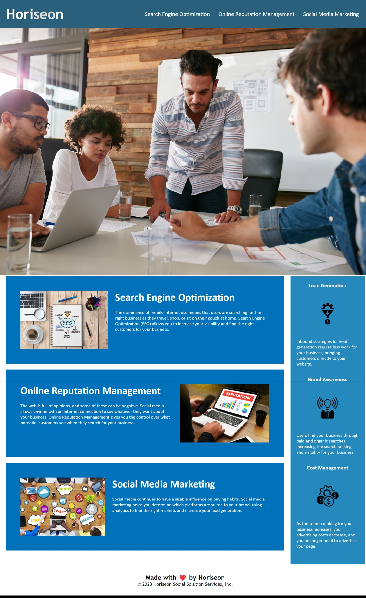

# Horiseon: Leader in Search Engine Optimiazation & S.M Marketing

## Description

A webpage designed for Horiseon: The Leader in Search Engine Optimiazation and Social Media Marketing.
This webpage contains stylized boxes with information and a working navbar that directs you to the desired content.

## Installation

N/A

## Screenshot

## Credits

Sources for studying on the heariarchy of HTML Elements in a semantic manner

## License

Please refer to the LICENSE in the repo.

